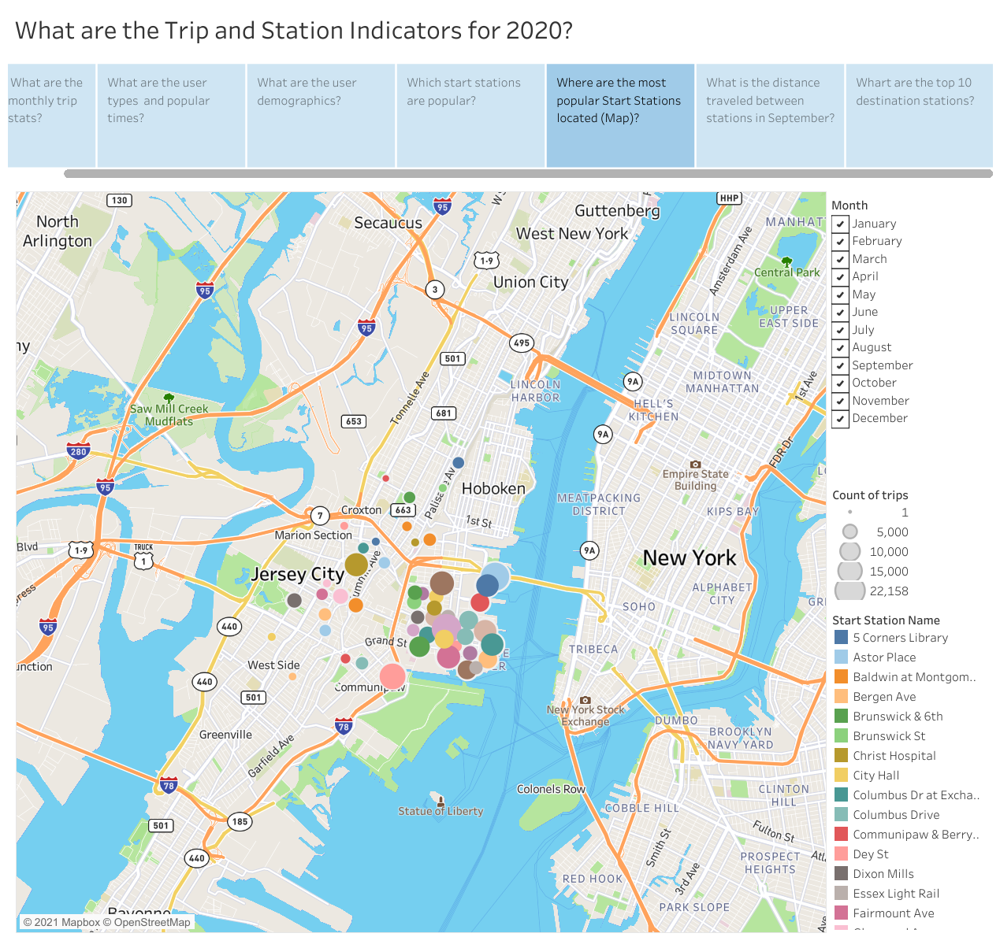

# Tableau - Citi Bike Analytics Project

## Background

This project uses citibike data and Tableau generate reports, dashboards, and visualization stories to publicize and improve the city program.

Since 2013, the Citi Bike Program has implemented a robust infrastructure for collecting data on the program's utilization. Through the team's efforts, each month bike data is collected, organized, and made public on the [Citi Bike Data](https://www.citibikenyc.com/system-data) webpage.

## Projet steps

1. Citibike data was downloaded from the citibikenyc.com website as CSV files. 
2. I used a python script to clean the data and organize to create new CSVs that could be used for the Tableau visualizations.
4. Tableau was used to further organize the data, created groupings, and calculated fields.
3. A number Tableau visualizations and dashboards were created and used to build a story.

**The following are some questions that can be answered by viewing the data and Tableau visualizations**

* How many trips have been recorded total during the chosen period?

* By what percentage has total ridership grown?

* How has the proportion of short-term customers and annual subscribers changed?

* What are the peak hours in which bikes are used during summer months?

* What are the peak hours in which bikes are used during winter months?

* What are the top 10 stations in the city for starting a journey? 

* What are the top 10 stations in the city for ending a journey? 

* What are the bottom 10 stations in the city for starting a journey? (Based on data, why?)

* What are the bottom 10 stations in the city for ending a journey (Based on data, why?)

* What is the gender breakdown of active participants (Male v. Female)?

* How effective has gender outreach been in increasing female ridership over the timespan?

* How does the average trip duration change by age?

* What is the average distance in miles that a bike is ridden?

**Maps include**

1. A static map that plots all bike stations with a visual indication of the most popular locations to start and end a journey with zip code data overlaid on top.

2.  A dynamic map that shows the distance traveled between stations during the month of September

## Viewing Tableau
The project can viewed on the Tableau public site at https://public.tableau.com/app/profile/tom.vossler/viz/Citibike_16337155421880/Story1

### File Structure

Images folder - Includes images used in readme file
Resources folder - Includes the csv data files used for the analysis
Citi_bike.ipynb file used for data cleaning and prep
Citibike Analysis.md - A written analysis to accompany the dashboards.
README.md - Summary information regarding the project.

